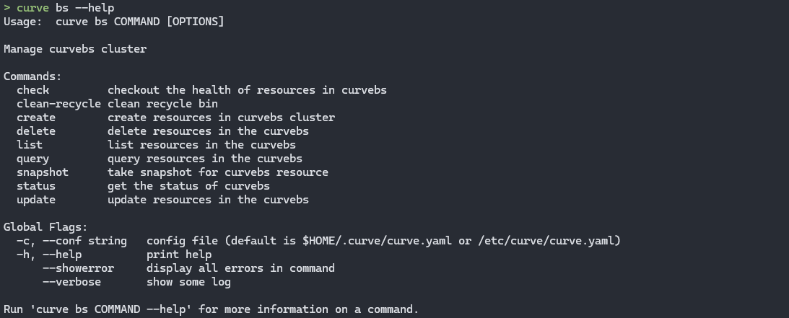
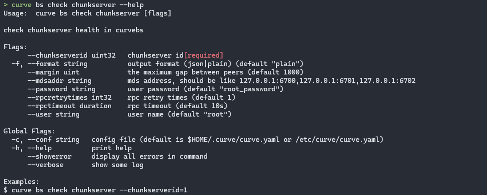
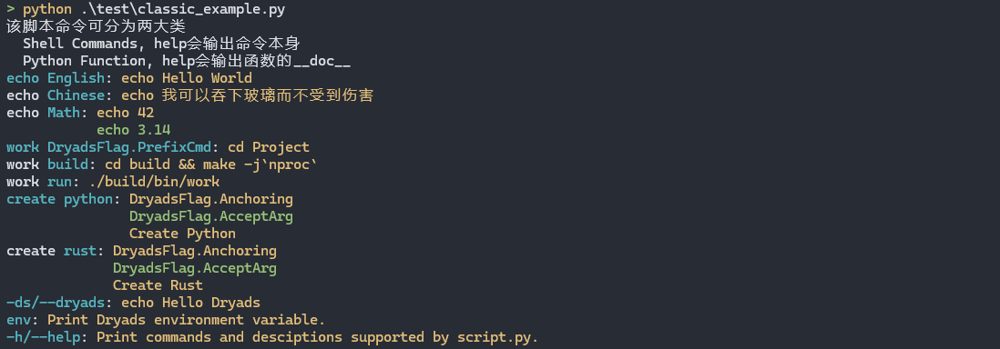
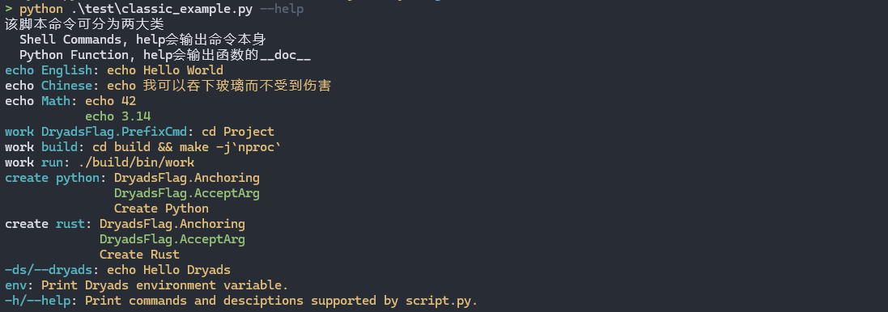
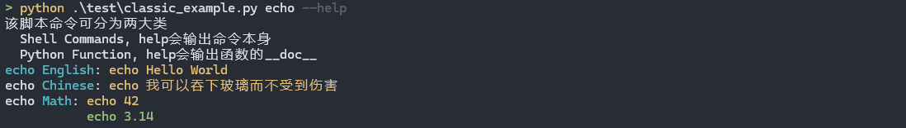
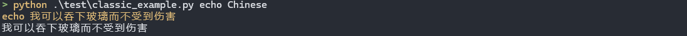
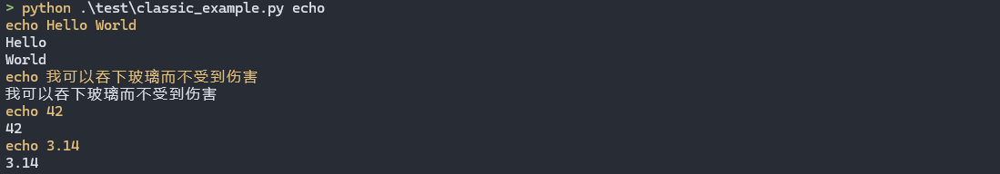

# Dryads

Simple CLI building tool and script management tool.

- 对标：
  - Simple CLI building tools: argparse, click and typer
  - Script management tool: [Just](https://github.com/casey/just)

## 发心

在图形化（GUI）软件出现之前，计算机操作员使用的是命令行（CLI）软件。两种软件本质是将人的指令交给计算机。

学术的说，在 CLI 中，有 argument 参数，不带前缀，是字符串；flag 标志，通常以`-`开头，通常是可选的，相当于 bool 值；options 选项，通常以`-`或者`--`开头，通常后接参数。注意`git add`中的`add`并不属于此三者的任何一个，而是命令本身。

形象的说，命令、参数、标志和选项是人和计算机交流的语言。而围绕某一个事物的一系列修饰词中，将归纳汇总并依次连接，可形成树形结构，很多命令行工具的选项都是。

举个 🌰，[网易的分布式存储系统](https://github.com/opencurve/curve)下有对集群的运维工具[curve-tool](https://github.com/opencurve/curve/tree/master/tools-v2)

  
有子命令，分别是`bs`（管理块存储集群）、`completion`()、`fs`（管理文件存储集群）、`upgrade`（升级）。

使用一个子命令继续看  
  
还有子命令，可以理解为针对块存储集群的各种操作，比如`check`（检测）、`create`（创建资源）、`delete`（删除资源）、`list`（罗列资源）等等。

继续使用一个子命令继续看
  
还有子命令，对于“检测”这个动作，还能继续“修饰”，到底检测什么“事物”

继续使用一个子命令继续看
  
至此确实没有了，开始添加 flag 了

可以想象，将这里所有的子命令取出来，并通过前后关系作为 Parent 结点和 Child 结点，可以形成树形结构。

再举个 🌰，在完成[CMU 15445 Lab](https://15445.courses.cs.cmu.edu/)过程中，需要较多命令，比如测试、格式化、打包等等。而每个动作还能细分，比如 Lab 分成多个 Project，每个 Project 又分成多个 Task。于是就出现了“测试 Project1 Task1 相关代码”这样的命令。同理，格式化和打包操作也类似。所以可形成如下树形结构（以 Json 表示）

```json
{
    "test": {
        "p1": {
            "t1": ...,
            "t2": ...,
            ...
        },
        "p2": ...,
        ...
    },
    "format": ...,
    "submit": ...,
}
```

故本项目的使用场景呼之欲出

- Simple CLI building tools: 如果命令行工具可以描述为嵌套的子命令，则该框架可以很简单的构建。
- Script management tool: 如果围绕某个项目或者在工作流中有一系列的命令，可以用该框架管理使之维护在一个文件中。同时大量的命令几乎无法记忆（比如在 15445 中使用的命令），通过子命令的方式使记忆它们称为可能（子命令对应一个脚本）。同时，文件主体是一个 Python 文件，命令作为字符串嵌入其中，同样是脚本语言，Python 有较于 Bash 或者 Powershell 强的多的表意能力和跨平台性。

该工具以嵌入我的工作流中并极大的提高我的效率。

## Install

- 通过 PyPI：[PyPI](https://pypi.org/project/dryads/)

  ```bash
  pip install dryads
  ```

  同时会下载命令`ds`，它会在当前路径递归向上寻找`dryadsfile`文件并使用 Python 解释器运行它。我们也建议每个项目下都有一个`dryadsfile`用来管理维护该项目需要命令，原因在[Just Further Ramblings](https://github.com/casey/just/tree/master?tab=readme-ov-file#further-ramblings)。

## Use

- 命令`ds`，如上，它会在当前路径递归向上寻找`dryadsfile`文件并使用 Python 解释器运行它。
  - 编译器通常通过文件后缀名识别文件类型，但是`dryadsfile`并没有文件后缀，在 VSCode 中，可以在`.vscode/settings.json`中添加下面内容解决。
    ```json
    "files.associations": {
        "dryadsfile": "python"
    },
    ```
- 如果是在 Linux 系统，通过在脚本前添加 shebang

  ```python
  #!/usr/bin/env python3
  # -*- coding: utf-8 -*-
  ```

  则可以通过`./script.py`这种很接近命令的形式使用

使用字符串表达脚本内容，而 Python 中“万物皆对象”，可以将函数本身作为值传递。使用`dict`数据类型即可描述出树形结构，将该`dict`交给框架，子命令的解析和执行交给框架即可。

下面是一个经典的例子。

```python
# test/classic_example.py
from dryads import Dryads, DryadsContainer, DryadsFlag, run_shell_cmd

def create_python():
    run_shell_cmd(f"poetry new {DryadsContainer.DryadsArg}")

def create_rust():
    run_shell_cmd(f"cargo new {DryadsContainer.DryadsArg}")

CMDS = {
    "echo": {
        "English": "echo Hello World",
        "Chinese": "echo 我可以吞下玻璃而不受到伤害",
        "Math": ["echo 42", "echo 3.14"],
    },
    "work": {
        DryadsFlag.PrefixCmd: ["cd Project"],
        "build": "cd build && make -j`nproc`",
        "run": "./build/bin/work",
    },
    "create": {
        "python": [
            DryadsFlag.Anchoring,
            DryadsFlag.AcceptArg,
            create_python,
        ],
        "rust": [
            DryadsFlag.Anchoring,
            DryadsFlag.AcceptArg,
            create_rust,
        ],
    },
    ("-d", "--dryads"): "echo Hello Dryads",
}

Dryads(CMDS)
```

直接执行上文件输出如下  


相当于  


其中子命令`env`和`-h`/`--help`是默认生成的

对于各级子命令，也能使用`-h`（或者`--help`）选项


下面聊聊语法

- 以嵌套的`dict`数据结构描述树形结构
- `dict`的键只能是`str`或者`tuple[str]`或者`DryadsFlag`（这是什么后面再聊）来描述子命令
- 叶子节点以`str`/`Callable`/`list[str | Callable | DryadsFlag]`类型表示具体的要执行的脚本内容。

  - 每个`str`类型字面量作为一个 Shell 脚本一起交给 Shell 执行，即一个字符串可以是多行的，它们是连续的。

    - 如果在`list[str]`中有`cd`命令，列表中的其他字符串中的命令不会被影响。

- 执行：一个命令的所有子命令相当于从根到叶子的路径

  - 叶子节点：  
    

  - 中间节点：执行该节点子树中的所有叶子节点  
    

- 标记`DryadsFlag`，当希望改变某些默认的行为时，以标记的方式实现。其本身是枚举量，作为键或者叶子执行修改某种行为。

  - `DryadsFlag.Anchoring`: 作为叶子的值, 表示该叶子中的命令都是以执行脚本的路径开始, 默认从脚本所在的路径开始, 例子在[Anchoring](./examples/flag_anchring.py)
  - `DryadsFlag.InVisible`: 作为叶子的值, 表示执行的脚本是否打印, 默认打印, 使用该标志表示不打印, 例子在[InVisible](./examples/flag_invisiable.py)
  - `DryadsFlag.IgnoreErr`: 作为叶子的值, 表示命令执行出错后是否停止, 默认停止, 使用该标志表示不停止, 例子在[IgnoreErr](./examples/flag_ignore_err.py)
  - `DryadsFlag.PrefixCmd`: 作为某个节点的键, 其值对应的脚本为其所有兄弟节点的子树中所有脚本的前置脚本, 例子在[PrefixCmd](./examples/flag_prefix_cmd.py)
    - 该标记只能用于`dict`不能用于`list`，但往往是对叶子节点`list`中的一系列命令设置前置脚本，可通过再套一层 dict 解决。

- 参数: 将所有的子命令匹配之后的命令行参数, 即视为 dryads 的参数, 可以通过`dryads.argv`获取, 例子在[MultiLineCmd](./examples/accept_arg_func.py)

## 用户

- [BusTub lab test script](https://github.com/zweix123/bustub_2023spring_backup/blob/master/script.py#L146): [介绍](https://github.com/zweix123/CS-notes/blob/master/README.md#CMU15445)
- [Note Tool](https://github.com/zweix123/CS-notes/blob/master/dryadsfile#L292)
